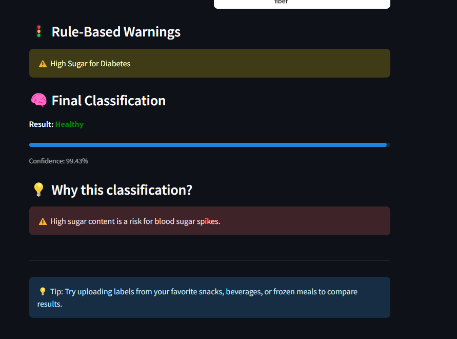

# 🥗 NutriLensAI: Rule-Augmented Neural Network for Nutrition Label Classification

NutriLensAI is a deep learning-powered health assistant that helps users interpret nutrition labels in a simple, actionable format. By combining Optical Character Recognition (OCR), rule-based logic, and a neural network classifier, the system identifies whether a food item is **Healthy**, requires **Caution**, or should be **Avoided**—empowering individuals to make informed dietary decisions.

> **Tech Stack:** Python · EasyOCR · PyTorch · NumPy · Streamlit · Matplotlib  
> **AI Methods:** Rule-based logic + MLP classifier with Weighted Loss & Early Stopping  
> **Accuracy:** 84% validation accuracy across 3 health categories  
> **Role:** Sole developer and designer

---

## 📸 Demo

### Upload Label Image

### Nutrient Analysis & Visualization

### Prediction Results & Explanations

- Upload a food label image  
- System extracts nutritional content using OCR  
- Classifies the label with explainable feedback  
- Visual outputs: Bar Chart, Radar Chart, Confusion Matrix

---

## 🔍 Problem Statement

Reading and understanding nutrition labels is tedious for many people, especially those managing diabetes, hypertension, or obesity. NutriLensAI automates this process, offering quick and clear nutritional feedback based on both:
- **Scientific rules** (e.g., sugar > 20g = Avoid)
- **Learned patterns** from training data via a neural network

---

## 🧠 How It Works

### 1. OCR & Preprocessing  
- Uses **EasyOCR** to extract text from label images  
- Applies parsing and cleaning to isolate values for: Calories, Sugar, Sodium, Fat, etc.

### 2. Rule-Based Annotation  
- Domain-specific rules are applied (e.g., high sugar → Avoid)  
- These labels are used to both train and guide the neural network

### 3. Neural Network (RuleAugmentedMLP)  
- Input: 8–12 nutritional features  
- Architecture: Multi-Layer Perceptron (MLP) with ReLU + Softmax  
- Loss: Weighted CrossEntropyLoss (for class imbalance)

### 4. Training Enhancements  
- **Early Stopping** (patience = 15 epochs)  
- **Best Model Checkpointing** for optimal generalization

---

## 📊 Output & Visualizations

| Visualization      | Purpose                                                        |
|--------------------|----------------------------------------------------------------|
| **Bar Chart**      | Shows nutritional values per category (e.g., sugar, fat, etc.) |
| **Radar Chart**    | Highlights nutrient balance across categories                  |
| **Color-Coded UI** | Healthy (Green), Caution (Yellow), Avoid (Red)                |
| **Explainability** | Example: “⚠️ High sugar is a risk for diabetics”              |

---

## 📈 Results

- **Training Loss**: Dropped from 1.1 to 0.24  
- **Validation Loss**: Plateaued at ~0.43  
- **Confusion Matrix**: Balanced accuracy across all 3 classes  
- **Validation Accuracy**: **84%**

---

## 🚀 Future Enhancements

- 📱 Real-time mobile app with camera scan  
- 🌐 Cloud API for wider health app integration  
- 🌍 Multilingual label support  
- 📸 Visual symbol detection (e.g., warning icons)  
- 🧑‍🦯 Voice assistance for visually impaired users  
- 🥗 Personalized diet plan recommendations

- ## 📌 Key Takeaways

✅ Blends symbolic AI (rules) with deep learning  
✅ Tackles real-world problems with end-user utility  
✅ Emphasizes explainability and trust in AI predictions  

---

## 📬 Contact

Got feedback or collaboration ideas?  
📧 Email: Reach me via [vishvendrareddy.site](https://vishvendrareddy.site)

